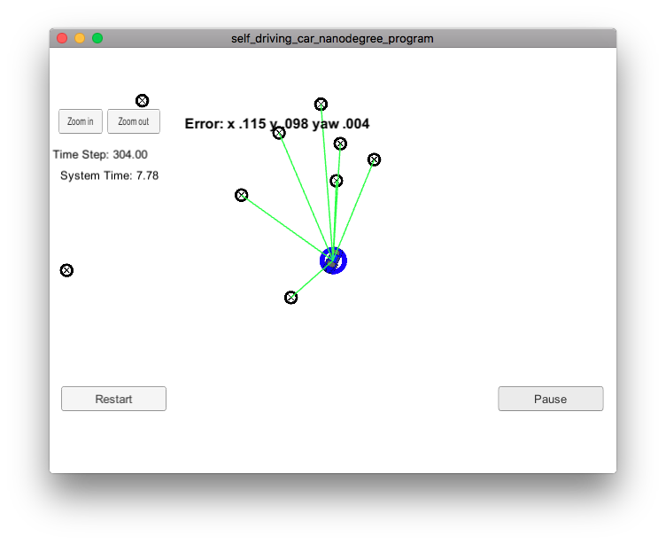

# Kidnapped Vehicle Project (Particle Filter)
Udacity Self-Driving Car Engineer Nanodegree Program

This project uses a [particle filter](https://en.wikipedia.org/wiki/Particle_filter) to localize a moving vehicle in a simulator and maintaining that localization despite noisy sensors and continuous motion. The idea of a particle filter is to use a cloud of randomly placed and oriented particles to represent possible positions of the vehicle, replicating those particles that best predict the observed landmarks, and removing those that predict poorly.

The simulator can be downloaded from the [Udacity github repository](https://github.com/udacity/self-driving-car-sim/releases).

The supporting websockets code (using the [uWebSockets library](https://github.com/uNetworking/uWebSockets)) and project structure come from the [Udacity repository](https://github.com/udacity/CarND-Kidnapped-Vehicle-Project).
The README at that repository has extensive details for build and setup.

## Basic Build Instructions

1. Clone this repo.
2. `./clean.sh`
3. `./build.sh`
4. `./run.sh`

## Files
[particle_filter.cpp](https://github.com/gardenermike/kidnapped-vehicle/blob/master/src/particle_filter.cpp) implements the particle filter.

[helper_functions.h](https://github.com/gardenermike/kidnapped-vehicle/blob/master/src/helper_functions.h) implements functions to load the sample data and perform some repeated mathematical operations.

## Discussion
Localization using technology like GPS has limits in precision that render it insufficient to safely operate vehicles. Errors in GPS are measured in meters. For safe driving, an error of meters could place a vehicle in the wrong lane, through a guardrail, or into a building. In order to navigate using a map, and autonomous vehicle needs accuracy measured in centimeters. Particle filters are a computationally tractable method to localize within a region based on high precision map landmarks that have been previously measured.

The particle filter in this project is designed to localize given some existing data, such as GPS coordinates. Using these coordinates, which are expected to have some inaccuracy, a set of particles is generated based on a gaussian distribution with the mean at the measured location and orientation of the vehicle. Using these particles allows finite and discrete calculations, rather than an attempt to calculate a continuous distribution. These individual calculations can be implemented to run efficiently. A nice benefit of using discrete particles is that the particle count can be tuned to balance accuracy and computation time.

The particle filter is a loop. A set of particles each representing a possible vehicle position are seeded with the initial measurements. Then the loop begins. Given the measured velocity, the particles are shifted in the direction anticipated based on their orientation estimate. Next, distances are predicted to the landmarks expected within sensor range. These distance predictions are compared to the measured distances to landmarks from the sensors on the vehicle. Next, the particles are each assigned a weight based on the accuracy of their landmark predictions. Finally, the particles are resampled based on weight, with the more heavily weighted particles being sampled at a higher probability.

I am using 100 particles my filter. I found that higher numbers of particles improve accuracy by only a few percent beyond what 100 particles can achieve, with increasing computational complexity. I tried as few particles as ten, and found that my accuracy was only about 50% worse. In the real world, using a smaller particle count might be a perfectly acceptable trade-off.

### Results
The proof is in the performance. In the simulator, the filter consistently keeps a tight bound on the position of the vehicle.

A video of a partial run in the simulator is on [YouTube](https://youtu.be/mg-dXm0rnY0). The performance is somewhat slow because of the screen capture.
